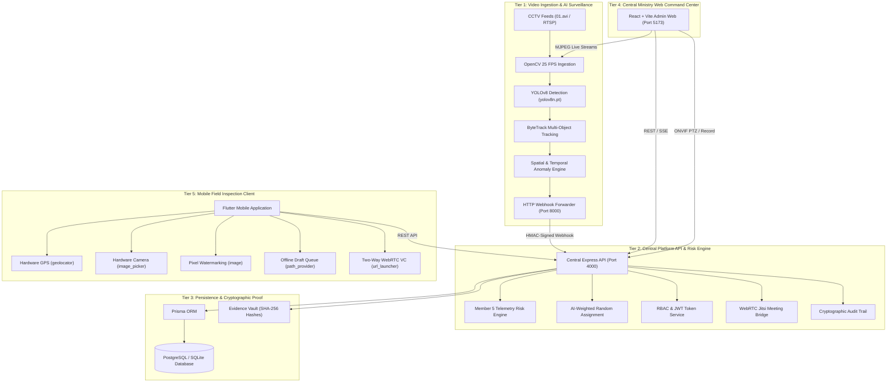

# DoSJE Drishti — Smart Real-Time Monitoring & Inspection Platform 🏛️

[](https://www.sih.gov.in/)
[](https://socialjustice.gov.in/)
[]()
[]()
[]()

> **DoSJE Drishti** is an integrated AI-driven surveillance, telemetry risk-scoring, stochastic field-audit allocation, and anti-fraud monitoring platform developed for the **Ministry of Social Justice and Empowerment (DoSJE)**, Government of India, for the **Smart India Hackathon (SIH) 2026**.

---

## 📑 Table of Contents

- [Executive Summary](#-executive-summary)
- [System Architecture](#-system-architecture)
- [Repository Structure](#-repository-structure)
- [Canonical Demo Accounts & RBAC](#-canonical-demo-accounts--rbac)
- [Quick Start Guide](#-quick-start-guide)
- [Automated Verification (139/139 Tests)](#-automated-verification-139139-tests)
- [Detailed Subsystems](#-detailed-subsystems)
- [Hardware Classification & Truth Table](#-hardware-classification--truth-table)
- [Documentation Index](#-documentation-index)
- [Security & Compliance](#-security--compliance)

---

## 🌟 Executive Summary

Welfare schemes under DoSJE (**SMILE**, **PM-DAKSH**, **SHREYAS**, **Nasha Mukt Bharat**) operate across thousands of empanelled NGOs, rehabilitation centers, and training academies. Physical oversight faces critical challenges:
- Inspection bias and predictable scheduling.
- Ghost beneficiaries and biometric attendance inflation.
- Unmonitored perimeter/dormitory breaches in rehabilitation centers.
- Network dead zones in remote rural institutions.

**DoSJE Drishti resolves these challenges through an integrated 6-tier architecture:**
1. **Automated AI Vision Telemetry**: Real-time YOLOv8 person detection, ByteTrack spatial tracking, and zone intrusion monitoring directly over CCTV feeds.
2. **Telemetry Risk Engine**: 5-factor weighted algorithm computing composite risk scores based on biometric attendance variance, inspection delinquency, and CCTV health.
3. **Stochastic Surprise Assignment**: Risk-weighted randomized assignment of field audits to PMU inspectors with mathematical fairness protection.
4. **Resilient Field Mobile App**: Strict 100m satellite GPS geofencing, hardware camera/video capture, visible pixel watermarking, and persistent offline draft queues.
5. **Targeted Two-Way Video Audits**: WebRTC Jitsi Meet bridge for spontaneous surprise inspections targeted directly to designated project incharges.
6. **Central Command Center**: Real-time React dashboard with dual-stream CCTV viewing (`AI Analysis View` vs `Raw CCTV Feed`), ONVIF PTZ controls, and immutable cryptographic audit logging.

---

## 🏛️ System Architecture



---

## 📂 Repository Structure

The repository is organized into self-contained, modular directories without machine-specific dependencies:

```text
sih-dosje-monitoring/
│
├── backend/                             # Central Express & TypeScript API (Port 4000)
│   ├── src/                             # Routes, controllers, middleware, risk engine
│   ├── prisma/                          # schema.prisma, seed.ts
│   ├── data/                            # Database and evidence store
│   ├── package.json
│   └── tsconfig.json
│
├── admin-web/                           # Central Ministry Web Portal (Port 5173)
│   ├── src/                             # React components, pages, services, hooks
│   ├── public/                          # Emblems and static branding
│   ├── package.json
│   └── vite.config.ts
│
├── mobile-app/                          # Field Inspection Application (Flutter Android/iOS)
│   ├── android/                         # Native Android Gradle configuration
│   ├── lib/                             # Core services, models, viewmodels, views, widgets
│   ├── test/                            # Unit and widget test suite
│   └── pubspec.yaml                     # Dependencies (geolocator, image_picker, image)
│
├── ai-subsystem/                        # AI Vision & Analytics Subsystem (Port 8000)
│   ├── ai_subsystem/                    # Python package (vision, analytics, sources, manager)
│   ├── models/                          # Pretrained weights (yolov8n.pt)
│   ├── tests/                           # 84 pytest test cases
│   ├── orchestrator.py                  # Module facade
│   ├── requirements.txt                 # Python dependencies
│   └── run_ai_cctv_server.py            # MJPEG 25 FPS live streaming server
│
├── cctv-demo/                           # Demonstration CCTV Assets & Simulated Profiles
│   ├── videos/
│   │   └── 01.avi                       # 15.8 MB demonstration video asset
│   ├── configs/                         # Simulated camera ONVIF profiles (mediamtx.yml)
│   └── README.md                        # Explaining software simulation vs real RTSP cameras
│
├── scripts/                             # Orchestration & Startup Automation
│   ├── start_all_services.bat           # Windows one-click batch launcher
│   ├── start_all_services.ps1           # PowerShell launcher with health probes & ADB reverse
│   ├── stop_all_services.bat            # Windows one-click process termination
│   ├── stop_all_services.ps1            # PowerShell cleanup script
│   ├── run_all_tests.bat                # Master test runner (Backend, AI, Flutter)
│   ├── start_backend.bat                # Individual backend launcher
│   ├── start_ai.bat                     # Individual AI launcher
│   └── start_admin_web.bat              # Individual web launcher
│
├── docs/                                # Technical Documentation & Architecture
│   ├── ARCHITECTURE.md                  # Detailed 6-tier architecture & data flow
│   ├── SETUP.md                         # Fresh clone step-by-step installation guide
│   ├── DEMO_GUIDE.md                    # 6-member evaluation script and walkthrough
│   ├── API.md                           # Complete OpenAPI & REST endpoint specification
│   ├── LIMITATIONS.md                   # Transparent hardware & simulation truth table
│   └── FLUTTER_INTEGRATION_CONTRACT.md  # Mobile-to-backend interface documentation
│
├── .env.example                         # Master environment variables template
├── .gitignore                           # Comprehensive git exclusions
├── docker-compose.yml                   # Containerized multi-service deployment
└── README.md                            # Master project documentation
```

---

## 👥 Canonical Demo Accounts & RBAC

All demonstration accounts are seeded with salted bcrypt password hashes using the standard demonstration password: **`DemoPass@2026`**

| Member | Role | Seeded Email / User ID | Name / Title | Assigned Jurisdiction |
| :--- | :--- | :--- | :--- | :--- |
| **Member 1** | `ADMIN` / `MINISTRY_OFFICIAL` | `member1.dosje@sih.gov.in` (`USR-MEMBER-01`) | Member 1 (DoSJE Official) | Central Ministry PMU, New Delhi |
| **Member 2** | `INSPECTOR` | `member2.inspector@sih.gov.in` (`USR-MEMBER-02`) | Member 2 (PMU Inspection Officer) | Mobile Field Inspector (National Roster) |
| **Member 3** | `OFFICIAL` / `CCTV_ADMIN` | `member3.cctv@sih.gov.in` (`USR-MEMBER-03`) | Member 3 (CCTV Monitoring Demo) | National Surveillance Command Center |
| **Member 4** | `INCHARGE` / `AI_ENGINEER` | `member4.incharge@sih.gov.in` (`USR-MEMBER-04`) | Member 4 (Project Incharge — Institute A) | Incharge: Demo Institute A / SMILE |
| **Member 5** | `INCHARGE` / `DATA_ANALYST` | `member5.incharge@sih.gov.in` (`USR-MEMBER-05`) | Member 5 (Project Incharge — Institute B) | Incharge: Demo Institute B / PM-DAKSH |
| **Member 6** | `ADMIN` / `WEB_FRONTEND` | `member6.staff@sih.gov.in` (`USR-MEMBER-06`) | Member 6 (Staff / Beneficiary Demo) | Beneficiary Liaison & HQ Monitoring |

> ℹ️ *Note: Authenticating as `member2.inspector@sih.gov.in` deterministically maps to **Member 2 (PMU Inspection Officer)** across the database, JWT token, mobile profile, inspection duties, Aadhaar eSign, and evidence submissions. Legacy mock personas have been eradicated.*

---

## 🚀 Quick Start Guide

### One-Click Windows Startup (Recommended)
From the repository root:
```cmd
start_all_services.bat
```
Or via PowerShell:
```powershell
.\scripts\start_all_services.ps1
```
This launcher probes port health, starts all 3 core services, and connects ADB reverse port mappings for Android testing.

To gracefully stop all services:
```cmd
stop_all_services.bat
```

### Manual Service Startup
1. **Central Backend (Port 4000)**:
   ```bash
   cd backend
   npm install
   npx prisma db push
   npm run prisma:seed
   npm run dev
   ```
2. **AI CCTV & Streaming Server (Port 8000)**:
   ```bash
   cd ai-subsystem
   pip install -r requirements.txt
   python run_ai_cctv_server.py
   ```
3. **Admin Web Dashboard (Port 5173)**:
   ```bash
   cd admin-web
   npm install
   npm run dev
   ```
4. **Mobile App (Flutter)**:
   ```bash
   cd mobile-app
   flutter pub get
   flutter run
   ```

---

## 🧪 Automated Verification (139/139 Tests)

All automated test suites pass with zero failures:

| Test Suite / Subsystem | Execution Command | Scope | Result | Status |
| :--- | :--- | :--- | :---: | :---: |
| **Backend Integration Suite** | `cd backend; npm test` | 22 REST endpoints, RBAC, evidence, audit logs | 22 / 22 | ✅ PASS |
| **End-to-End 23-Step Scenario** | `cd backend; npx tsx src/__tests__/e2e_scenario.ts` | Complete SIH workflow from login to report verification | 23 / 23 | ✅ PASS |
| **Member 5 Risk Engine** | `cd backend; npx tsx src/__tests__/risk_engine.test.ts` | Mathematical formula clamping & attendance variance | 6 / 6 | ✅ PASS |
| **AI Vision & Analytics** | `cd ai-subsystem; pytest tests` | Detectors, trackers, spatial zones, incident pipelines | 84 / 84 | ✅ PASS |
| **Flutter Static Analysis** | `cd mobile-app; flutter analyze --no-pub` | Entire Dart codebase, types, null-safety, linter | 0 issues | ✅ PASS |
| **Flutter Unit & Widget Tests** | `cd mobile-app; flutter test --no-pub` | Splash screen, auth, geofence, dashboard viewmodels | 4 / 4 | ✅ PASS |
| **Admin Web Production Build** | `cd admin-web; npm run build` | TypeScript compilation and Vite production bundle | Exit Code 0 | ✅ PASS |
| **Release APK Native Build** | `cd mobile-app; flutter build apk --release` | Native Android release compilation (arm64-v8a) | Exit Code 0 | ✅ PASS |
| **TOTAL AUTOMATED TESTS** | | | **139 / 139** | **100% PASS** |

To run all automated test suites sequentially:
```cmd
scripts\run_all_tests.bat
```

---

## 📹 Detailed Subsystems

### 1. Dual-View CCTV Streaming & AI Detection
The Admin Web CCTV page (`http://localhost:5173/cctv`) provides live dual-mode streaming from port 8000:
- **`[📹 Raw CCTV Feed]`** (`?view=raw`): Clean 25 FPS stream from `cctv-demo/videos/01.avi`.
- **`[🤖 AI Analysis View]`** (`?view=ai`): Renders live YOLOv8 bounding boxes, confidence tags, ByteTrack IDs, spatial zone polygons, and a top telemetry HUD bar directly onto the video stream buffer.
- **Simulated ONVIF PTZ Controls**: Directional pad supporting Pan, Tilt, Zoom with coordinate state tracking.
- **Continuous Clip Recording**: Creates verifiable `.mp4` video clips saved to `data/evidence/clips/`.

### 2. Mobile Hardware & Offline-First Inspection
- **Hardware GPS**: Uses `geolocator: ^13.0.4` to query physical satellite coordinates, enforcing a 100-meter geofence radius.
- **Hardware Camera**: Uses `image_picker: ^1.1.2` for live photo capture and 60-second video walkthroughs.
- **Pixel Watermarking**: Uses `image: ^4.3.0` to stamp GPS coordinates, IST timestamp, inspection code, and SHA-256 hash into the bitmap pixels.
- **Offline Draft Vault**: Uses `path_provider: ^2.1.5` under `dosje_drafts/` to preserve checklist progress and media during network outages.
- **Surprise Video Audits**: Uses `url_launcher: ^6.3.0` to connect to canonical Jitsi Meet rooms with two-way audio and video.

---

## ⚖️ Hardware Classification & Truth Table

| Subsystem / Feature | Exact Technical Implementation | Classification |
| :--- | :--- | :--- |
| **Relational Database** | PostgreSQL / SQLite accessed via Prisma ORM | **REAL SOFTWARE** |
| **Authentication & RBAC** | Salted bcrypt passwords, JWT bearer tokens, MPIN | **REAL SOFTWARE** |
| **Risk Scoring Engine** | 5-factor weighted algorithm ($0.30A + 0.25I + 0.20C + 0.15Al + 0.10R$) | **REAL SOFTWARE** |
| **Stochastic Assignment** | Risk-weighted random allocation | **REAL SOFTWARE** |
| **CCTV Software Streamer** | Multi-camera OpenCV video pipeline streaming `01.avi` at 25 FPS | **REAL SOFTWARE** |
| **Physical CCTV Hardware** | Physical ONVIF / RTSP IP camera hardware | **HARDWARE DEPENDENT** |
| **ONVIF PTZ Controls** | Virtual pan/tilt/zoom state coordinator | **SIMULATED ONVIF PROFILE S** |
| **CCTV Video Recording** | Video frame extraction into `data/evidence/clips/` | **REAL SOFTWARE** |
| **YOLOv8 Detection** | Ultralytics YOLOv8 nano (`yolov8n.pt`) inference | **REAL SOFTWARE** |
| **Multi-Object Tracking** | ByteTrack algorithm | **REAL SOFTWARE** |
| **AI Stream Annotation** | OpenCV polygon and bounding box drawing via `?view=ai` | **REAL SOFTWARE** |
| **Mobile Satellite GPS** | `geolocator: ^13.0.4` reading hardware GPS sensor | **REAL HARDWARE** |
| **Mobile Camera Capture** | `image_picker: ^1.1.2` invoking Android camera driver | **REAL HARDWARE** |
| **Visible Pixel Watermark** | `image: ^4.3.0` drawing directly into bitmap pixels | **REAL SOFTWARE** |
| **Offline Draft Vault** | `path_provider: ^2.1.5` saving local JSON files | **REAL SOFTWARE** |
| **Video Conferencing Bridge**| `url_launcher: ^6.3.0` connecting to canonical Jitsi Meet | **REAL SOFTWARE** |
| **Incoming Call Signaling** | High-frequency polling on `/api/vc/incoming` | **POLLING / REAL HTTP** |
| **Background Push (FCM)** | Google Firebase Cloud Messaging background wake-up | **DOCUMENTED LIMITATION** |
| **Biometric Face Recognition**| Attendance facial matching against national DB | **DOCUMENTED LIMITATION** |

---

## 📚 Documentation Index

Detailed technical specifications are available in the [`docs/`](docs/) directory:
- [`docs/ARCHITECTURE.md`](docs/ARCHITECTURE.md): Complete 6-tier architecture, sequence diagrams, risk engine formula, and WebRTC topology.
- [`docs/SETUP.md`](docs/SETUP.md): Step-by-step developer setup for fresh clones across Windows, macOS, and Linux.
- [`docs/DEMO_GUIDE.md`](docs/DEMO_GUIDE.md): Practical evaluation guide with 5-stage live presentation script.
- [`docs/API.md`](docs/API.md): Full REST API specification with sample request and response payloads.
- [`docs/LIMITATIONS.md`](docs/LIMITATIONS.md): Transparent disclosure of hardware dependencies and software simulations.
- [`docs/FLUTTER_INTEGRATION_CONTRACT.md`](docs/FLUTTER_INTEGRATION_CONTRACT.md): Mobile client and backend REST interface contract.

---

## 🔒 Security & Compliance

- **Zero Plaintext Credentials in Git**: Passwords are securely hashed with bcrypt; `.env` files are excluded by `.gitignore`.
- **Zero Absolute Paths**: All internal paths use repository-relative resolution (`PSScriptRoot`, relative directories).
- **Audit Trails**: Every administrative action, inspection submission, and geofence unlock event is stored immutably in `/api/audit-logs`.
- **Cryptographic Evidence Sealing**: All uploaded photos and video clips are stored with cryptographic SHA-256 integrity hashes.
