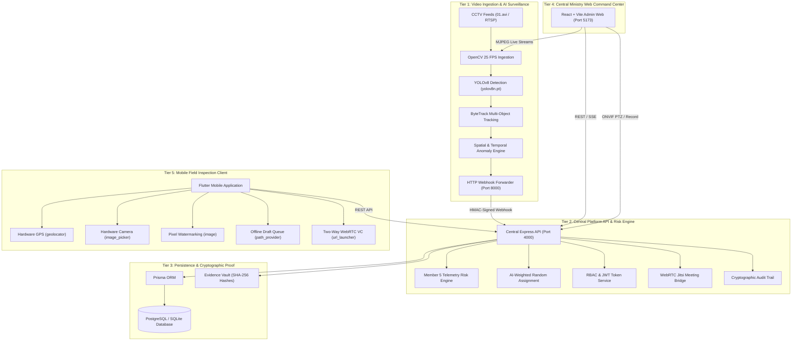

# DoSJE Drishti — System Architecture Specification 🏛️

**Platform**: DoSJE Drishti — Smart Real-Time Monitoring & Inspection System  
**Organization**: Ministry of Social Justice and Empowerment (DoSJE), Government of India  
**Hackathon**: Smart India Hackathon (SIH) 2026  

---

## 1. Architectural Vision & 6-Tier Architecture

The DoSJE Drishti platform is designed as an integrated multi-tier enterprise architecture combining automated CCTV computer vision telemetry, randomized anti-bias field audits, spatial geofencing, and central administrative governance.



---

## 2. Core Subsystems

### A. Central Backend (Node.js / Express / TypeScript / Prisma)
- **Directory**: `backend/`
- **Port**: `4000`
- **Role**: Master data store, security gateway, and business logic engine.
- **Key Modules**:
  - `auth.routes.ts`: Salted bcrypt password verification, MPIN login, JWT issuance, and RBAC middleware.
  - `inspections.routes.ts`: Surprise assignment, geofence verification, checklist completion, inspector workload fairness.
  - `cctv.routes.ts`: Stream registry, heartbeat ping, simulated ONVIF Profile S PTZ controls, clip recording.
  - `alerts.routes.ts`: Ingestion of vision alerts from port 8000, lifecycle updates (open $\to$ acknowledged $\to$ resolved).
  - `vc.routes.ts`: Targeted routing resolving `Project` $\to$ `Institute` $\to$ `Incharge User ID` for surprise audio/video inspections.
  - `evidence.routes.ts`: Image/video upload with SHA-256 verification and streaming retrieval.
  - `audit.routes.ts`: Immutable government compliance logging recording actor, role, IP, action, and payload.

### B. Member 5 Canonical Risk Engine
- **Mathematical Formula**:
  $$\text{Risk Score} = 0.30 \times A + 0.25 \times I + 0.20 \times C + 0.15 \times Al + 0.10 \times R$$
  - $A$ (Attendance Variance): Discrepancy between biometric log and physical count.
  - $I$ (Inspection History): Days elapsed since last physical inspection.
  - $C$ (CCTV Health Score): Offline camera count, lens occlusion, or stream drops.
  - $Al$ (Open Unresolved Alerts): Frequency and severity of recent vision incidents.
  - $R$ (Reporting Punctuality): Delinquency in mandatory compliance submissions.
- **Priority Bands**:
  - Low Risk ($<40$): `NORMAL` priority routine queue.
  - Medium Risk ($40 - 69$): `PRIORITY` automated inspection list.
  - High Risk ($\ge 70$): `URGENT` immediate surprise inspection trigger.

### C. AI Vision Subsystem (Python / OpenCV / YOLOv8 / ByteTrack)
- **Directory**: `ai-subsystem/`
- **Port**: `8000`
- **Model**: `yolov8n.pt` (Lightweight 6.5 MB real-time person detector).
- **Dual Streaming Modes**:
  - `http://localhost:8000/api/v1/stream/{camera_id}?view=raw`: Clean, unprocessed CCTV stream from `01.avi`.
  - `http://localhost:8000/api/v1/stream/{camera_id}?view=ai`: Annotated overlay displaying YOLO bounding boxes, class labels, confidence scores, ByteTrack IDs, spatial zone boundaries, and telemetry HUD.
- **Forwarding Pipeline**: Background daemon transmits detected anomalies to Central Backend `/api/alerts` via HMAC-authenticated HTTP webhooks.

### D. Admin Web Dashboard (React / Vite / TypeScript / Tailwind CSS)
- **Directory**: `admin-web/`
- **Port**: `5173`
- **Role**: Command center for Central Ministry officials.
- **Key Views**:
  - **KPI Dashboard**: Flagship scheme metrics, active institutes, camera health, and risk distribution graphs.
  - **Live CCTV Feeds**: 6-camera live grid with view-mode toggles (`AI Analysis` vs `Raw`), ONVIF PTZ directional pad, and recording buttons.
  - **Alerts Triage**: Real-time anomaly table with filters, evidence viewer, and one-click "Raise for Inspection" trigger.
  - **Inspections Management**: Audit assignment status, inspector workload fairness charts, and signed summary reports.
  - **Audit Logs**: Immutable log view with cryptographic tamper detection.

### E. Mobile Field Inspection App (Flutter / Dart)
- **Directory**: `mobile-app/`
- **Role**: Field app for PMU Inspectors and Institute Incharges.
- **Hardware Integrations**:
  - **GPS**: Live satellite fix via `geolocator: ^13.0.4`, enforcing 100m geofence radius.
  - **Camera**: Photos and short video walkthroughs via `image_picker: ^1.1.2`.
  - **Watermark**: Pixel-level text burn via `image: ^4.3.0` stamping GPS, IST timestamp, project code, and SHA-256 hash.
  - **Offline Drafts**: Persistent local JSON queue via `path_provider: ^2.1.5` under `dosje_drafts/`.
  - **Video Call**: Targeted WebRTC bridge via `url_launcher: ^6.3.0` connecting to canonical Jitsi Meet rooms.

---

## 3. Data Flow & Interaction Sequences

### Sequence 1: Field Inspection & Tamper-Evident Sign-off
```text
Inspector Mobile App              Central Backend (Port 4000)          Database (Prisma)
       │                                     │                              │
       ├──── 1. Load Assigned Duties ───────>│                              │
       │<─── Returns Duties ─────────────────┤                              │
       │                                     │                              │
       ├──── 2. Acquire Satellite GPS ───────┤ (Local Sensor)               │
       │     (Compute Haversine Distance)    │                              │
       ├──── 3. Verify Geofence Arrival ────>│                              │
       │<─── HTTP 200 (Unlocked) ────────────┤                              │
       │                                     │                              │
       ├──── 4. Capture Entrance Photo ──────┤ (Hardware Camera)            │
       │     (Burn Pixel Watermark + SHA256) │                              │
       ├──── 5. Upload Evidence Payload ────>│──── Store Watermarked JPG ──>│
       │<─── Evidence ID & Hash Confirmed ───┤                              │
       │                                     │                              │
       ├──── 6. Submit Headcount & Sign ────>│──── Save Inspection ────────>│
       │<─── Audit Certificate Generated ────┤──── Log Audit Compliance ───>│
```

### Sequence 2: CCTV AI Detection to Surprise Inspection
```text
CCTV Loop (01.avi)       AI Subsystem (Port 8000)       Central Backend (4000)       Admin Web (5173)
       │                            │                             │                         │
       ├──── 1. Decode Frame ──────>│                             │                         │
       │     (YOLOv8 + ByteTrack)   │                             │                         │
       │     (Detect Zone Breach)   │                             │                         │
       │                            ├──── 2. POST /api/alerts ───>│                         │
       │                            │     (HMAC Signed Payload)   ├──── 3. SSE Broadcast ──>│
       │                            │                             │    (Display Red Alert)  │
       │                            │                             │                         │
       │                            │                             │<─── 4. Raise Inspection ┤
       │                            │                             │     (Compute Risk Score)│
       │                            │                             ├──── 5. Random Assign ───┤
       │                            │                             │     (Notify Inspector)  │
```
